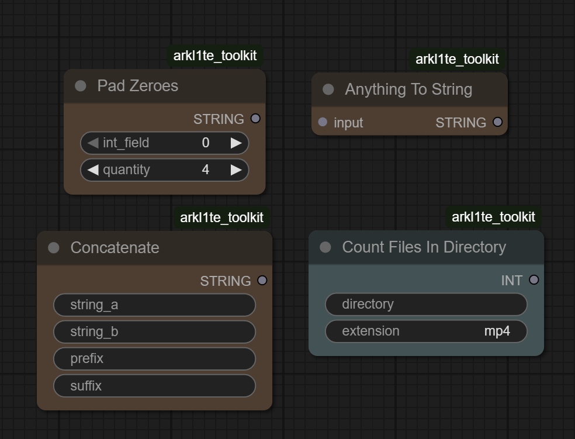

# Arkl1te's Toolkit

A collection of convenient nodes for ComfyUI. Mainly for string operations.



## Nodes

- `STRING`:
    - Pad Zeroes
    - Anything To String
    - Concatenate
- `INT`:
    - Count Files In Directory

## Installation

1. Clone this repository under `ComfyUI/custom_nodes`.
2. Restart ComfyUI.

## Develop

To install the dev dependencies and pre-commit (will run the ruff hook), do:

```bash
cd arkl1te_toolkit
pip install -e .[dev]
pre-commit install
```

The `-e` flag above will result in a "live" install, in the sense that any changes you make to your node extension will automatically be picked up the next time you run ComfyUI.